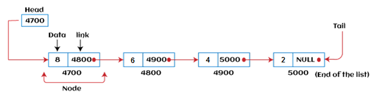

# LinkList

### Languages

## Singly Linked List

[Source Code](./singly.c)

## Doubly Linked List

[Source Code](./Doubly.c)

## Singly Circular Linked List

[Source Code](./SinglyCircular.c)

## Doubly Circular Linked List

[Source Code](./DoublyCircular.c)